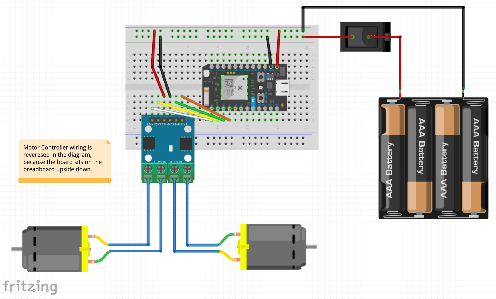

# Example Bot

To run, enter `node bot` into your command line terminal.

## Wiring Example

## Reference
[Johnny Five](http://johnny-five.io/)
[particle-io](https://www.npmjs.com/package/particle-io)
[voodoospark](https://github.com/voodootikigod/voodoospark)